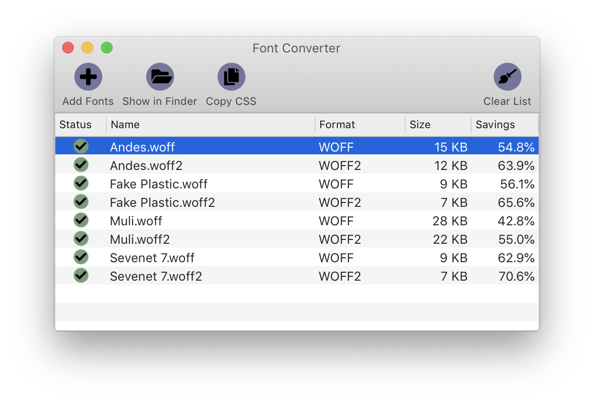

# font-converter

An application for converting fonts from TrueType to WOFF/WOFF2. Written in Objective-C/C++. Requires Mac OS 10.12 (Sierra) or higher.



## Releases

Binary versions are available on the [Releases](https://github.com/jcfieldsdev/font-converter/releases) page.

Binaries are self-signed but not notarized, so Mac OS 10.15 (Catalina) and higher display an error upon launching it. [Right-click the application icon and select "Open"](https://support.apple.com/guide/mac-help/open-an-app-by-overriding-security-settings-mh40617/mac) to enable the option to bypass this security warning.

## Guide

### Converting fonts

There are a few ways to add fonts to convert:

- Select "Add Fonts" from the "File" menu or toolbar (or use the keyboard shortcut `Cmd`+`O`) and pick the font files in the file chooser.
- Drag-and-drop the font files from the Finder onto the queue in the application window or onto the Dock icon.
- Select the font files in the Finder, then select the application menu, the "Services" submenu, and the "Font Converter" menu item.

Fonts in the TrueType (.ttf, .otf) format are converted to WOFF/WOFF2, and fonts in the WOFF/WOFF2 (.woff, .woff2) format are converted to TrueType.

### Other options

If you have at least one font selected, you can select "Show in Finder" from the "File" menu or toolbar (or use the keyboard shortcut `Cmd`+`Shift`+`R`) to open the containing folder in the Finder.

You can select "Copy CSS" from the "File" menu or toolbar to copy CSS `@font-face` rules for the converted fonts to the clipboard. This only works for fonts that have completed conversion. The program tries to determine the generic font family (serif, sans serif, or monospace), style (italic), and weight (bold) of each file, as in the following example output:

```css
@font-face {
	font-family: "Mohave";
	font-style: normal;
	font-weight: bold;
	src: url("Mohave-Bold.woff2") format("woff2"), url("Mohave-Bold.woff") format("woff"), url("Mohave-Bold.ttf") format("truetype");
}

@font-face {
	font-family: "Mohave";
	font-style: italic;
	font-weight: bold;
	src: url("Mohave-BoldItalic.woff2") format("woff2"), url("Mohave-BoldItalic.woff") format("woff"), url("Mohave-BoldItalic.ttf") format("truetype");
}

@font-face {
	font-family: "Mohave";
	font-style: italic;
	font-weight: normal;
	src: url("Mohave-Italic.woff2") format("woff2"), url("Mohave-Italic.woff") format("woff"), url("Mohave-Italic.ttf") format("truetype");
}

@font-face {
	font-family: "Mohave";
	font-style: normal;
	font-weight: normal;
	src: url("Mohave-Regular.woff2") format("woff2"), url("Mohave-Regular.woff") format("woff"), url("Mohave-Regular.ttf") format("truetype");
}
```

However, it cannot determine cursive or fantasy fonts or weights besides "normal" and "bold."

### Preferences

You can open the **Preferences** window by selecting it from the application menu (or use the keyboard shortcut `Cmd`+`,`).


*Output format* determines whether the program generates WOFF files, WOFF2 files, or both. WOFF2 has better compression, but WOFF has wider [browser support](https://caniuse.com/?search=woff). Each format has a *Compression level* slider, where lower values provide faster compression and decompression but higher values provide smaller file sizes.

WOFF2 also has the *Allow transforms* option, which determines if additional transforms are done to the `glyf`, `loca`, and `hmtx` tables of the font (see the [WOFF2 format specification](https://www.w3.org/TR/WOFF2/#table_format)). If this option is deselected, these tables are left in their original, uncompressed form.

## Acknowledgments

Incorporates [sfnt2woff-zopfli](https://github.com/bramstein/sfnt2woff-zopfli) by Bram Stein, itself derived from [sfnt2woff](https://people.mozilla.org/~jkew/woff/) by Jonathan Kew of Mozilla and the [Zopfli compression algorithm](https://github.com/google/zopfli) by Lode Vandevenne and Jyrki Alakuijala of Google.

Incorporates [WOFF2](https://github.com/google/woff2) and [Brotli](https://github.com/google/brotli) code by Google.

Uses [compress](https://fontawesome.com/icons/compress), [plus](https://fontawesome.com/icons/plus), [folder open](https://fontawesome.com/icons/folder-open), [copy](https://fontawesome.com/icons/copy), [times](https://fontawesome.com/icons/times), [broom](https://fontawesome.com/icons/broom), and [check](https://fontawesome.com/icons/check) icons by [Font Awesome](https://fontawesome.com/).

## Authors

- J.C. Fields <jcfields@jcfields.dev>

## License

- Tri-licensed under:
  - [Mozilla Public License, version 2](https://opensource.org/licenses/MPL-2.0)
  - [GNU General Public License, version 2](https://opensource.org/licenses/GPL-2.0)
  - [GNU Lesser General Public License, version 2.1](https://opensource.org/licenses/lgpl-2.1.php)
- Zopfli code licensed under [Apache license, version 2](https://opensource.org/licenses/Apache-2.0)
- WOFF2 and Brotli code licensed under [MIT license](https://opensource.org/licenses/MIT)
